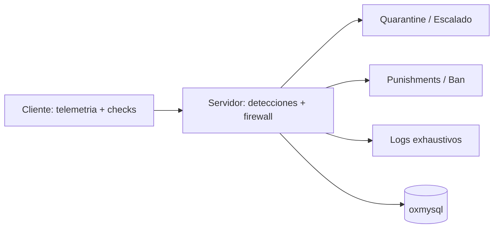

# LyxGuard


Anticheat modular **server-first** para FiveM/ESX, con firewall de eventos, anti-spoof y trazabilidad exhaustiva.

## Estado del proyecto
- Licencia: `MIT`
- Estado: `Activo`
- Objetivo: reducir abuso real de eventos/admin spoof/economia/entidades
- Integracion recomendada: `lyx-panel`

## Que incluye
- Firewall server-side para eventos criticos:
  - allowlist
  - schema validation
  - rate-limit
  - anti-replay
- Hardening anti-spoof en rutas sensibles.
- Score de riesgo acumulativo + cuarentena progresiva.
- Detecciones por modulos (cliente y servidor), con prioridad server.
- Honeypots de alta confianza.
- Logging exhaustivo:
  - JSONL + texto
  - timeline previo a warn/ban
  - correlacion por actor/evento/resultado
- Perfiles de runtime:
  - `rp_light`
  - `production_high_load`
  - `hostile`

## Requisitos
- FiveM (artefacto actualizado).
- `es_extended`
- `oxmysql`

## Instalacion rapida
1. Copiar `lyx-guard` a `resources/[local]/lyx-guard`.
2. En `server.cfg`:
```cfg
ensure oxmysql
ensure es_extended
ensure lyx-guard
```
3. Reiniciar servidor.
4. Revisar logs de inicio y estado de modulos.

## Configuracion
- Archivo principal: `config.lua`
- Perfil recomendado en produccion:
```lua
Config.RuntimeProfile = 'production_high_load'
```
- Logging exhaustivo:
```lua
Config.ExhaustiveLogs = {
  enabled = true,
  writeJsonl = true,
  writeText = true
}
```

## Arquitectura


## Modelo de seguridad
- Toda decision critica vive en servidor.
- El cliente aporta senales y verificacion auxiliar.
- Eventos anomales de alto riesgo se bloquean antes del handler final.
- Se evitan rutas dinamicas peligrosas (`load`, `loadstring`, exec remoto).

## Integracion con LyxPanel
- Comparticion de contexto de seguridad para auditoria.
- Dependencia cruzada opcional: al faltar uno, se degradan funciones dependientes.

## Si queres aportar
Contribuciones tecnicas bienvenidas:
1. Prioriza cambios pequenos y medibles.
2. Si agregas deteccion, inclui:
   - calibracion de umbral
   - metadatos de log
   - plan anti-falsos positivos
3. Mantene compatibilidad con perfiles runtime.

Ver:
- `CONTRIBUTING.md`
- `SECURITY.md`

## QA offline (recomendado antes de release)
```bash
node tools/qa/check_events.js
```

## Docs
- Pack parity (comparativa, no SaaS): `docs/pack_parity/PACK_PARITY_PASS1.md`
- Evidencia tecnica: `docs/pack_parity/PACK_PARITY_PASS2.md`
- Brechas/riesgos: `docs/pack_parity/PACK_PARITY_PASS3.md`
- Plan de cierre: `docs/pack_parity/PACK_PARITY_PASS4.md`
- Perfil produccion alta carga: `docs/operations/PRODUCCION_ALTA_CARGA.md`

## Roadmap
- Usar Issues/PRs del repo para el backlog y el progreso.

## Checklist de release recomendado
- Perfiles revisados (`rp_light`, `production_high_load`, `hostile`)
- Eventos criticos con schema/rate-limit/permiso
- Logging exhaustivo funcionando
- Retencion/rotacion de logs validada
- Plan de rollback definido

## Licencia
MIT. Ver `LICENSE`.
