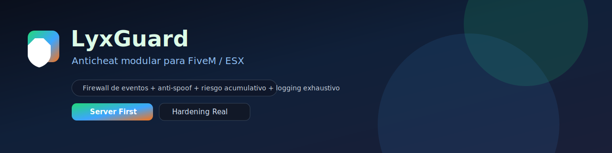

# LyxGuard



Anticheat modular **server-first** para FiveM/ESX. Enfoque: bloquear abuso real (spoof de eventos admin, floods, payloads anomales) con trazabilidad exhaustiva y perfiles de carga.

Este recurso esta pensado para funcionar **junto a** `lyx-panel`.
La instalacion soportada/recomendada es **tener ambos activos**: `lyx-guard` + `lyx-panel`.
Si ejecutas solo uno, el sistema sigue levantando, pero se degradan/inhabilitan funciones dependientes y perdes cobertura de seguridad.

## Tabla de contenido
1. Instalacion
2. Configuracion (defaults)
3. Seguridad (modelo y garantias)
4. Sistema de sanciones (warn/quarantine/ban)
5. Logging exhaustivo (archivos locales)
6. Perfiles de runtime
7. Integracion con LyxPanel
8. Troubleshooting
9. QA offline
10. Mapa del proyecto
11. Docs

## Requisitos
- FiveM (artefacto actualizado).
- `es_extended`
- `oxmysql`
- Recomendado: `lyx-panel`

## Instalacion (paso a paso)
1. Copiar carpeta `lyx-guard` a:
   - `resources/[local]/lyx-guard`
2. Asegurar orden en `server.cfg`:
```cfg
ensure oxmysql
ensure es_extended
ensure lyx-guard
ensure lyx-panel
```
3. Reiniciar el servidor.
4. Verificar consola:
   - migraciones (LyxGuard aplica migraciones versionadas)
   - estado del firewall
   - carga de modulos

## Configuracion (defaults importantes)
Archivo: `config.lua`

### Perfil de runtime (tuning)
```lua
-- Valores: default | rp_light | production_high_load | hostile
Config.RuntimeProfile = 'production_high_load'
```

### Firewall de eventos / trigger protection
LyxGuard protege server-side:
- allowlist de namespaces/eventos
- schema validation (tipos/rangos/longitudes)
- rate-limit por jugador/evento
- anti-replay para acciones sensibles

Los limites exactos dependen del perfil.
Guia recomendada:
- `docs/operations/PRODUCCION_ALTA_CARGA.md`

### Logging exhaustivo (archivos locales)
```lua
Config.ExhaustiveLogs = {
  enabled = true,
  writeJsonl = true,
  writeText = true
}
```

Salida:
- carpeta: `logs/`
- incluye timeline previo a warn/ban y correlation_id

## Seguridad (modelo y garantias)
Principios:
- **Server-authoritative**: el servidor decide; el cliente aporta senales auxiliares.
- Bloqueo antes del handler final para eventos anomales de alto riesgo.
- Sin rutas peligrosas de ejecucion dinamica (`load`, `loadstring`, exec remoto).

Anti-spoof:
- deteccion de ejecucion de eventos admin (LyxPanel/txAdmin) por jugadores sin permisos
- validacion de payloads
- escalado por reincidencia (segun perfil)

## Sistema de sanciones (warn -> quarantine -> ban)
LyxGuard implementa:
- score/riesgo acumulativo
- cooldowns por razon
- cuarentena progresiva para casos grises
- evidencia (logs + timeline) para revisiones

La politica exacta (duraciones, escalado) se ajusta en `config.lua`.

## Perfiles de runtime
Valores:
- `rp_light`: tolerante, menos agresivo
- `production_high_load`: para servidores con picos altos de eventos
- `hostile`: mas cerrado, pensado para entornos con spoof/flood

Guia con valores exactos:
- `docs/operations/PRODUCCION_ALTA_CARGA.md`

## Integracion con LyxPanel
Cuando ambos estan activos:
- mejor auditoria (panel + guard con correlation_id)
- mejor respuesta a spoof de acciones admin
- degradacion controlada: si falta uno, se deshabilitan features dependientes y se notifica

## Troubleshooting (comun)
1. Bans/flags inesperados:
   - bajar agresividad: usar `rp_light` o subir limites en `production_high_load`
   - revisar logs exhaustivos (timeline previo)
2. Alto ruido por eventos legitimos:
   - subir `massiveTriggersPerMinute` y los limites del firewall (ver docs de operaciones)
3. No aparecen logs:
   - confirmar `Config.ExhaustiveLogs.enabled = true`
   - verificar permisos de escritura del recurso (carpeta `logs/`)

## QA offline (antes de release)
```bash
node tools/qa/check_events.js
```

## Mapa del proyecto (estructura)
```text
lyx-guard/
  fxmanifest.lua
  config.lua
  README.md
  LICENSE
  SECURITY.md
  CONTRIBUTING.md
  .gitignore

  server/
    main.lua
    bootstrap.lua
    trigger_protection.lua
    detections.lua
    punishments.lua
    quarantine.lua
    ban_system.lua
    exhaustive_logs.lua
    connection_security.lua
    panel.lua
    admin_config.lua
    migrations.lua
    utils.lua
    webhooks.lua

  client/
    main.lua
    core.lua
    panel.lua
    protection_loader.lua
    protection_registrar.lua
    detections/*.lua
    protections/*.lua

  shared/
    lib.lua
    functions.lua
    structured_logger.lua
    blacklists/*.lua

  database/
    database.sql
    database_reset.sql

  logs/
    .gitkeep

  html/
    index.html
    css/style.css
    js/app.js
    vendor/fontawesome/...

  tools/
    qa/check_events.js

  docs/
    banner.svg
    INSTALL_SERVER.md
    DEEP_DIVE.md
    COMPARISON.md
```

## Docs
- Instalacion y configuracion (servidor): `docs/INSTALL_SERVER.md`
- Como funciona (profundidad): `docs/DEEP_DIVE.md`
- Comparaciones (otros anticheats y enfoque): `docs/COMPARISON.md`

## Contribuir
Contribuciones tecnicas bienvenidas:
- cambios pequenos y revisables
- si agregas deteccion: umbral + metadata de log + plan anti falsos positivos

Ver:
- `CONTRIBUTING.md`
- `SECURITY.md`

## Licencia
MIT. Ver `LICENSE`.

