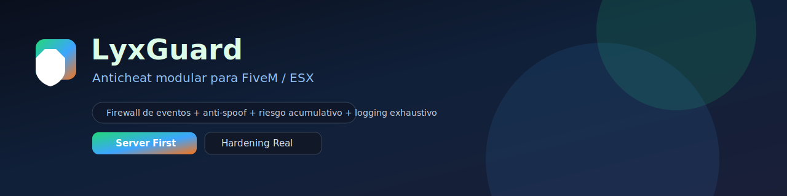

<div align="center">

# LyxGuard



### Anticheat modular **server-first** para FiveM/ESX

<p align="center">
  <strong>Anti-cheat client + server</strong> • <strong>Firewall de eventos</strong> • <strong>Secure Bridge (HMAC)</strong> • <strong>Quarantine</strong> • <strong>Logs exhaustivos</strong>
</p>

<p align="center">
  <a href="docs/INSTALL_SERVER.md">📦 Instalacion</a> •
  <a href="docs/DEEP_DIVE.md">🔬 Deep Dive</a> •
  <a href="docs/CONFIG_REFERENCE.md">⚙️ Config</a> •
  <a href="docs/COMPARISON.md">🆚 Comparaciones</a>
</p>

[](LICENSE)


[](https://github.com/Floppa3210/lyx-guard/actions/workflows/qa.yml)
[](https://github.com/Floppa3210/lyx-guard/stargazers)

</div>

---

## Estado del proyecto
- Licencia: `MIT`
- Estado: `Activo`
- Enfoque: **anticheat gratuito y open source** que no le pida a la comunidad gastar cientos de dolares
- Cobertura: detecciones **client-side** + validacion/autoridad **server-side** + intercomunicador seguro
- Instalacion recomendada: **`lyx-guard` + `lyx-panel` juntos**

> Importante: podes ejecutar `lyx-guard` solo, pero la instalacion soportada/recomendada es tener ambos activos (`lyx-guard` + `lyx-panel`). Si falta uno, hay degradacion/inhabilitacion de features dependientes y perdes cobertura/correlacion.

## Que incluye (resumen)
- **Detecciones client-side** (movimiento, combate, armas, entidades, inyeccion, visuales) con framework modular `RegisterDetection`.
- **Autoridad server-side**: valida eventos nativos de gameplay (explosiones, spawns, dano de armas, proyectiles, audio) — no confia en el cliente.
- **Firewall de eventos**: allowlist + schema validation + rate-limit + anti-replay en rutas sensibles.
- **Secure Event Bridge (nuevo)**: intercomunicador cliente↔servidor firmado con **HMAC-SHA256 + nonce anti-replay** para blindar tus propios eventos.
- **Anti-spoof**: bloquea intentos de ejecutar eventos admin (LyxPanel/txAdmin/recursos sensibles) sin permisos.
- **Risk score + quarantine progresiva** (menos falsos positivos).
- **Logs exhaustivos** a archivo (JSONL + texto, timeline previo a warn/ban, `correlation_id`).
- **Perfiles runtime**: `rp_light`, `production_high_load`, `hostile`.
- **Panel NUI propio** (tecla `F8`) con dashboard, detecciones, bans, warnings, sospechosos y tiempo real.

<div align="center">

## Por que usar LyxGuard

</div>

<table>
<tr>
<td width="50%">

### Deteccion (client + server)

```text
- Aimbot / no-recoil / magic bullet / rapid fire
- Noclip / speed / superjump / flyhack / teleport
- Godmode / health / armor / infinite ammo
- Injection / executor / menu / tamper
- No-props / magneto / vehiculo invisible
- Explosiones / spawns / super golpe / audio flood
```

</td>
<td width="50%">

### Autoridad y evidencia

```text
- Firewall server-side (allowlist + schema + rate-limit)
- Secure Bridge HMAC + nonce (anti event-trigger)
- Anti-spoof de eventos admin
- Quarantine/escalado + risk score
- Logs exhaustivos (JSONL + timeline)
- Perfiles runtime (rp_light/high_load/hostile)
```

</td>
</tr>
</table>

## Cobertura de detecciones

Framework modular: cada deteccion se registra con `RegisterDetection(name, config, handler, group)`
(client) o corre como handler de evento nativo (server). Todas escalan por el mismo pipeline
`MarkPlayerSuspicious` → risk/quarantine → `ApplyPunishment`.

### Client-side (`client/detections/*.lua`)
| Categoria | Detecciones |
|---|---|
| Movimiento | teleport, noclip, speedhack, superjump, flyhack, underground, wallbreach, tasktp, noragdoll, infinite_stamina, forced_animation |
| Combate / Aimbot | aimbot, aimbot_ultra, magic_bullet, no_recoil, rapid_fire |
| Armas | infinite_ammo, fastreload, norecoil, nospread, oneshoot, damage_modifier, weapon_spawn, weaponblacklist |
| Salud / God | godmode, healthhack, armorhack, health_regen, vehiclegodmode, invisibility |
| Entidades / spawn | explosion, cagetrap, entity_spam, explosion_spam, blacklisted_explosion, vehicle_spawn, particlespam, illegal_ped |
| Inyeccion / tamper | resource_injection, executor_detection, debugger_detection, menudetection, resourcetamper, scriptinjection, functionhook, citizen_exploit, model_exploit |
| Eventos / honeypot | eventspam, honeypot_event, freecam, spectate/spectateabuse, taskexploit |
| Economia | moneydrop, casinoexploit, jobexploit, money_exploit |
| Blacklists | blacklist_weapon, blacklist_vehicle, blacklist_ped |
| Visuales (nuevas) | **no_props**, **magneto**, **vehicle_invisible** |

Ademas: 14 modulos de proteccion activa en `client/protections/anti_*.lua`
(anti_aimbot, anti_noclip, anti_godmode, anti_speed, anti_tazer, anti_weapon, anti_yank, etc.).

### Server-side (`server/detections.lua`)
Validacion sobre eventos nativos de gameplay (el servidor es la autoridad, no el cliente):
`explosionEvent`, `ptFxEvent`, `clearPedTasksEvent`, `entityCreating` (firewall de spawn:
vehiculos/peds/objetos con budgets), `giveWeaponEvent`, `startProjectileEvent`,
`weaponDamageEvent`, `entityRemoved`, y **`CEventNetworkPlaySound`** (nuevo: alimenta
`super_punch` y `audio_flood`).

## Secure Event Bridge (HMAC + nonce)

Intercomunicador cliente↔servidor para **blindar tus propios eventos** contra spoof y replay,
inspirado en el enfoque anti-trigger de GoblinAC pero endurecido con firma real.

```lua
-- server: solo acepta triggers firmados por un cliente legitimo
RegisterSecureEvent('mi_recurso:hazAlgo', function(source, a, b)
    -- ...
end)

-- client: firma el evento con HMAC-SHA256 + nonce
exports['lyx-guard']:TriggerSecureServerEvent('mi_recurso:hazAlgo', a, b)
```

- La `key` por jugador se emite **solo servidor→cliente** (nunca viaja dentro de un evento firmado).
- Firma canonica: `HMAC(key, eventName|seq|nonce|ts|sha256(argsJson))`.
- Anti-replay por nonce + rotacion de key + clock-skew opcional.
- SHA-256 / HMAC-SHA256 en **Lua puro** (`shared/sha2.lua`, sin dependencias), verificado contra vectores RFC 4231.
- Config en `Config.SecureBridge`.

## Instalacion rapida
1. Copiar `lyx-guard` a `resources/[local]/lyx-guard`.
2. Recomendado: copiar `lyx-panel` a `resources/[local]/lyx-panel`.
3. En `server.cfg`:
```cfg
ensure oxmysql
ensure es_extended
ensure lyx-guard
ensure lyx-panel
```
4. Reiniciar y revisar consola (migraciones + firewall + modulos).

Guia completa:
- `docs/INSTALL_SERVER.md`

## Configuracion (entry points)
Archivo: `config.lua`

Perfil runtime:
```lua
Config.RuntimeProfile = 'default' -- rp_light | production_high_load | hostile
```

Secure bridge:
```lua
Config.SecureBridge.enabled = true
```

Logging exhaustivo:
```lua
Config.ExhaustiveLogs.enabled = true
```

Secciones principales de config: `Risk`, `BurstPattern`, `ServerAnomaly`, `Quarantine`,
`TriggerProtection`, `EventFirewall`, `SecureBridge`, `Panel`, `Punishments`, `BanHardening`,
`Connection`, `Permissions`, `ExhaustiveLogs`, `Discord`, `Screenshot`, `Movement`, `Combat`,
`Ultra`, `Entities`, `Blacklists`, `Advanced`.

Referencia completa:
- `docs/CONFIG_REFERENCE.md`

## Panel de administracion (NUI)
- Tecla por defecto: `F8` (`Config.Panel.key`), acceso via ACE (`lyxguard.panel` / `lyxguard.admin`).
- Secciones: Dashboard, Detecciones, Bans, Warnings, Sospechosos, Tiempo Real, Admin Config, Configuracion.
- Acciones del panel protegidas con token + nonce + anti-replay (mismo endurecimiento que el firewall).

## Testing / QA offline
Check de cobertura de schemas/allowlists (recomendado antes de release):
```bash
node tools/qa/check_events.js
```

## Estructura del proyecto
```text
lyx-guard/
  fxmanifest.lua
  config.lua
  README.md
  LICENSE
  SECURITY.md
  CONTRIBUTING.md

  client/
    core.lua              # framework RegisterDetection + loops por grupo
    secure_bridge.lua     # firma HMAC de eventos (cliente)
    detections/           # ~detecciones client-side por categoria
    protections/          # anti_* (proteccion activa)
    panel.lua             # NUI del panel
  server/
    detections.lua        # autoridad sobre eventos nativos de gameplay
    trigger_protection.lua# firewall de eventos (allowlist/schema/rate-limit/anti-spoof)
    secure_bridge.lua     # validacion HMAC + nonce (servidor)
    quarantine.lua        # escalado por strikes
    punishments.lua       # ApplyPunishment (sanciones + rate-limit)
    ban_system.lua        # bans con HWID/token + cache offline
    connection_security.lua # anti-VPN / VAC / name filter (opt-in)
    exhaustive_logs.lua   # JSONL + texto + timeline + correlation_id
    webhooks.lua          # integracion Discord
    panel.lua             # backend del panel
  shared/
    sha2.lua              # SHA-256 + HMAC-SHA256 (Lua puro)
    lib.lua               # utilidades compartidas
    blacklists/           # weapons / vehicles / events
  html/                   # UI del panel (NUI)
  tools/qa/               # checks offline
  docs/                   # documentacion
```

## Contribuir
Si queres aportar:
- Prioriza cambios pequenos y medibles.
- Si agregas deteccion:
  - umbral
  - metadata de log
  - plan anti falsos positivos

Ver:
- `CONTRIBUTING.md`
- `SECURITY.md`
